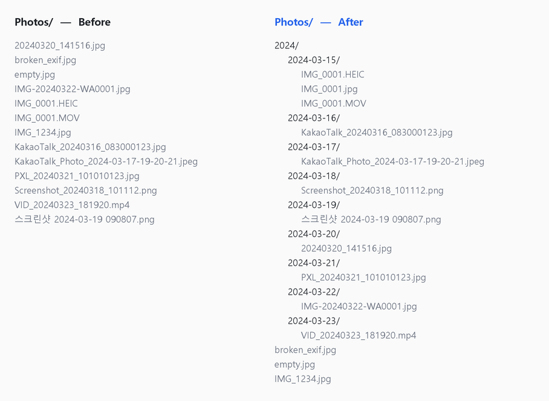
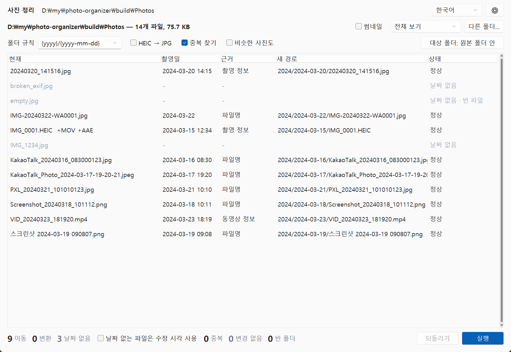

# Photo Organizer (사진 정리)


[한국어](README.md) · [中文](README.zh-CN.md) · [日本語](README.ja.md)

> **Works without an internet connection.**
> **Your photos are never uploaded anywhere.**
> **Every run can be undone.**

A Windows program that sorts the photos and videos piled up from phones, cameras and KakaoTalk into date folders (`2024/2024-03-15/`), converts iPhone HEIC to JPG, and sets duplicates aside.





## Download

- **Program**: get `photo-organizer.exe` from [Releases](https://github.com/microhan1/photo-organizer/releases) and double-click it. Nothing to install. (The exe is not signed; if SmartScreen warns, choose "More info → Run anyway".)
- **From source** (Python 3.12):

```bash
pip install -r requirements.txt
python main.py
```

## How to use

1. Drop a photo folder on the window.
2. Check the date taken, where it came from, and the new path in the table. Double-click a date to correct it (only the folder changes; the EXIF inside the file stays as it is).
3. Press **Run**. Changed your mind? **Undo**.

Nothing changes before you press Run. The log (`organize_log.json`) is saved first; if it cannot be saved, no file is moved. Undo puts back moved files, removes the JPGs it made, and recreates the empty folders it removed.

| Status | Meaning |
| --- | --- |
| OK | Moves to the new path |
| Convert | Moves and converts HEIC → JPG |
| No date | No date found. Stays where it is by default (or the "No Date" folder, in Settings) |
| Duplicate | Goes to `_Duplicates` (never deleted) |
| Conflict | The name was taken; ` (2)` is added |
| No change | Already in place. A second run shows only this |

## Where the date comes from

The first one found, top to bottom. The "Based on" column says which.

| Order | Source | Notes |
| --- | --- | --- |
| 1 | EXIF `DateTimeOriginal` | JPG, HEIC, TIFF, RAW (DNG, CR2, NEF, ARW), PNG. The local time where it was taken (no time-zone shift) |
| 2 | EXIF `DateTimeDigitized`, `DateTime` | |
| 3 | Video metadata | MP4, MOV, 3GP. iPhone videos: the local `creationdate` first |
| 4 | File name | see below |
| 5 | Paired file | HEIC↔JPG, RAW↔JPG, photo↔Live Photo `.mov` |
| 6 | Modified time | Option, off by default. Marked "Modified time (uncertain)" |

A camera clock that was reset (2000-01-01 00:00 and the like) is marked "EXIF (suspect)", and a date in the file name wins over it. Dates in the future or before 1990 are not trusted (the range is in Settings).

## File names it understands

| From | Examples |
| --- | --- |
| KakaoTalk | `KakaoTalk_20240315_123456789.jpg`, `KakaoTalk_Photo_2024-03-15-12-34-56.jpeg` |
| Samsung | `20240315_123456.jpg`, `20240315_123456(1).jpg` |
| Google Photos / Pixel | `PXL_20240315_123456789.jpg`, `IMG_20240315_123456.jpg` |
| WhatsApp | `IMG-20240315-WA0001.jpg` |
| Screenshots | `Screenshot_20240315_123456.png`, `스크린샷 2024-03-15 123456.png`, `Screen Shot 2024-03-15 at 12.34.56.png` |
| NAVER Band / LINE | `band_20240315.jpg`, `LINE_ALBUM_…_20240315…` |
| Anything else | `2024-03-15`, `20240315` or `2024.03.15` anywhere in the name |

Names without a date (`IMG_1234.jpg`, `DSC_0001.jpg`) are dated from EXIF or a paired file. More patterns can be added as regular expressions in Settings → Dates.

## Folder pattern

Pick `{yyyy}/{yyyy-mm-dd}` (default), `{yyyy}/{yyyy-mm}`, `{yyyy-mm-dd}`, `{yyyy}/{source}/{yyyy-mm-dd}` (`2024/KakaoTalk/2024-03-15/`) or type your own. Placeholders: `{yyyy}` `{mm}` `{dd}` `{yyyy-mm}` `{yyyy-mm-dd}` `{source}` (KakaoTalk, Screenshots, Messengers, Camera, Other) `{ext}`. Dates are `2024-03-15` in every language.

Files with the same name and another extension travel with the photo: `.mov` (Live Photo), `.aae` (iPhone edits), `.xmp`, the RAW original. If one of them cannot move, both stay.

## HEIC to JPG only

Choose **No sorting — convert HEIC only** at the bottom of the folder pattern list and press Run: folders stay as they are, and a JPG with the same name appears next to each HEIC. No Windows codec to install, nothing uploaded.

- EXIF (date taken, orientation, GPS, camera) and the colour profile (iPhone Display P3) are copied. The picture is actually turned upright, so viewers that ignore the orientation tag show it the right way.
- Quality 92 by default (80–100 in Settings). The original HEIC stays, or moves to `_Original_HEIC`; it is never deleted.
- The `.mov` of a Live Photo is not converted. Of a burst HEIC, the first image is converted.

Command line: `python main.py D:\Photos --heic-only`

## Duplicates

| Step | How | Default |
| --- | --- | --- |
| Identical | Same content (SHA-1). One stays, the rest go to `_Duplicates` | On |
| Same photo, other format | A HEIC and its JPG, a RAW and its JPG | Treated as a pair, never as duplicates |
| Similar | Perceptual hash (pHash), rotations too. Groups are shown; you choose what stays | Off (an estimate of the time is shown first) |

KakaoTalk re-compressions, smaller copies and re-saved copies are marked "suggested duplicate". Bursts get no suggestion: only you know which shot is best.

## Command line

```bash
python main.py D:\Photos --dry-run
python main.py D:\Photos --pattern "{yyyy}/{yyyy-mm}" --dest E:\Sorted --copy --convert-heic --dedupe
python main.py D:\Photos --undo
```

Options: `--pattern`, `--dest`, `--copy`, `--convert-heic`, `--heic-only`, `--dedupe`, `--similar`, `--use-mtime`, `--include-nodate`, `--dry-run`, `--undo`, `--lang ko|en|zh-CN|ja`

## What it does not do

- It does not edit photos (no cropping, no colour fixes). Conversion only turns them upright.
- No face recognition, no places, no sorting by person.
- It does not connect to any cloud (Google Photos, iCloud, OneDrive). OneDrive / iCloud "online-only" files are skipped unopened (opening one would start a download).
- It does not change EXIF. A date corrected in the table only changes the folder.
- It does not show GPS coordinates (it only copies them when converting).
- It never deletes a file straight away. Duplicates go to `_Duplicates` (or the Recycle Bin, if you choose so in Settings).

## Series

- Chaekgalpi Tools: [Music Folder Organizer](https://github.com/microhan1/music-folder-organizer) · [Music Tag Filler](https://github.com/microhan1/music-tag-filler)
- [Chaekgalpi Library](https://chaekgalpi.co.kr/tools/photoorganizer?utm_source=github&utm_medium=referral&utm_campaign=tool_cta&utm_content=photoorganizer) — a web service for logging the books you read and writing reviews (Korean only)

## License

MIT. Libraries: Pillow, pillow-heif (libheif), piexif, sv-ttk, tkinterdnd2.
