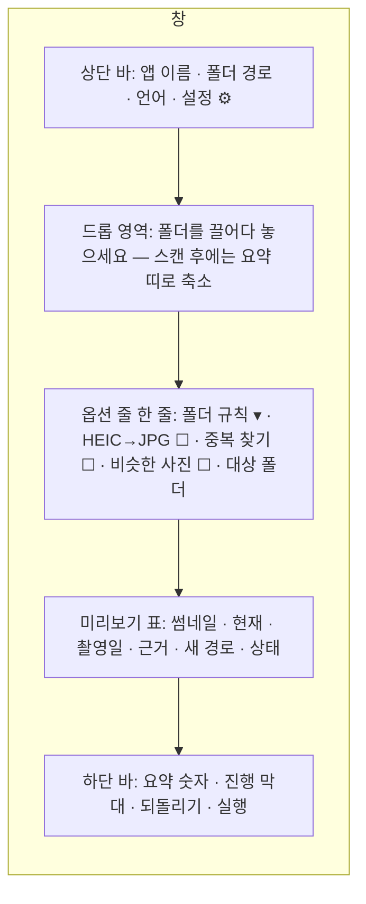

# PRD — 사진 정리 (photo-organizer)

작성일: 2026-10-04

## 개요

폰·카메라·카카오톡에서 쏟아진 사진과 동영상을 촬영 날짜별 폴더로 정리하고, HEIC는 JPG로 바꾸고, 같은 사진은 걸러내는 Windows 단일 실행 파일 도구다. 인터넷 연결이 없고, 원본은 사용자가 실행을 누르기 전까지 건드리지 않으며, 실행 뒤에도 되돌리기가 남는다.

**명칭**

| 구분 | 값 |
| --- | --- |
| 한글 명칭 | 사진 정리 |
| 영문 명칭 | Photo Organizer |
| 저장소명 / 실행 파일명 | `photo-organizer` / `photo-organizer.exe` |
| 앱 제목 (ko / en / zh-CN / ja) | 사진 정리 / Photo Organizer / 照片整理 / 写真整理 |

**대상 사용자**

- 10년치 폰 사진을 외장하드에 쏟아 놓고 손을 못 대는 사람
- 아이폰 사진을 PC로 옮겼는데 HEIC라 안 열리는 사람
- 카카오톡으로 받은 사진이 날짜 없이 쌓인 사람 (외국 툴은 이걸 못 잡는다)
- 사진을 남의 서버에 올리기 싫어서 온라인 변환기·클라우드를 안 쓰는 사람

**블로그 글 두 편**

프로그램은 하나, 글은 둘이다. "HEIC JPG 변환 무료 프로그램"과 "사진 날짜별 정리 프로그램"으로 따로 써서 두 검색어를 모두 잡는다. 두 글 모두 외장하드·NAS 링크 자리가 자연스럽다.

**다국어 지원**

- 언어 파일: `lang/ko.json`, `lang/en.json`, `lang/zh-CN.json`, `lang/ja.json`. 키는 영문 snake\_case
- 최초 실행 시 OS 언어 자동 선택. 4개 언어 밖이면 영어
- 화면 우상단 드롭다운으로 즉시 전환, 선택값은 실행 파일 옆 `settings.json`에 저장
- 버튼·안내·오류·완료 메시지·표 헤더·날짜 없음 폴더 이름(`날짜 없음` / `No Date` / `无日期` / `日付なし`) 전부 언어 파일에서. 코드에 문자열 하드코딩 금지
- 폴더 이름의 날짜 형식(`2024-03-15`)은 언어와 무관하게 ISO 고정. 정렬이 되고 어느 언어에서도 읽힌다

**기술 스택**

| 항목 | 선택 | 이유 |
| --- | --- | --- |
| 언어 | Python 3.12 | 음악 툴과 코드 공유 (mover·undo·i18n 그대로) |
| EXIF 읽기 | Pillow + piexif | 촬영일·방향·카메라. piexif는 쓰기용 |
| HEIC | pillow-heif | 읽기·변환. EXIF·ICC 프로파일 보존. 윈도우 코덱 설치 불필요 |
| 동영상 날짜 | 자체 파서 (MP4/MOV `mvhd` atom의 creation\_time) | 외부 프로그램 없이 QuickTime·MP4 촬영일 읽기 |
| 중복 | SHA-1 (완전 동일) + 지각 해시 pHash (비슷한 사진, 옵션) | imagehash 라이브러리 |
| GUI | tkinter + ttk + sv-ttk (Sun Valley 테마) | 기본 tkinter의 90년대 외관을 Windows 11 스타일로. MIT, 순수 파이썬 |
| 드래그 | tkinterdnd2 | 음악 툴과 동일 |
| 배포 | PyInstaller 단일 exe (Windows) | 더블클릭 실행. `python main.py`로 소스 실행도 유지 |

**배포 규칙**

- exe는 GitHub Releases 첨부. 첫 태그 `v0.1.0`
- 테스트 사진은 직접 찍은 것이나 CC0 이미지만 `samples/`에. HEIC 샘플 필수, EXIF 없는 샘플·카카오톡 이름 샘플 필수
- README 맨 위에 "인터넷 없이 동작", "사진은 어디에도 올라가지 않음", "되돌리기 있음" 세 줄
- 음악 툴과 같은 `mover.py`·`undo.py`를 쓰되, 이 저장소에서 수정한 것은 음악 툴에도 반영한다 (flush 실패 처리 포함)

## 기능 명세

**1. 날짜 판별 우선순위**

파일 하나의 "촬영 날짜"는 아래 순서로 처음 성공한 것을 쓴다. 어느 단계에서 얻었는지를 표의 "근거" 열에 표시한다.

| 순위 | 출처 | 대상 | 비고 |
| --- | --- | --- | --- |
| 1 | EXIF `DateTimeOriginal` | JPG, HEIC, TIFF, RAW(DNG·CR2·NEF·ARW), PNG(eXIf) | 촬영 순간. 가장 믿을 만함 |
| 2 | EXIF `DateTimeDigitized`, `DateTime` | 같음 | 1이 없을 때 |
| 3 | 동영상 메타데이터 `creation_time` | MP4, MOV, 3GP | `mvhd`·`moov` atom. 1904-01-01 기준 초 → 변환. 0이면 무시 |
| 4 | 파일명 패턴 | 전체 | 아래 패턴 표 |
| 5 | 같은 이름의 짝 파일 | HEIC↔JPG, RAW↔JPG, 사진↔.mov(라이브 포토) | 짝의 날짜를 빌려 씀 |
| 6 | 파일 수정 시각 (mtime) | 전체 | 옵션, 기본 끔. 켜면 근거에 "수정 시각(불확실)" 표시 |
| — | 실패 |  | `날짜 없음` 폴더, 기본 제외 |

파일명 패턴 (4순위). 전부 정규식으로 `patterns.py`에 두고, 사용자가 `settings.json`에 추가할 수 있다.

| 출처 | 예 | 추출 |
| --- | --- | --- |
| 카카오톡 | `KakaoTalk_20240315_123456789.jpg`, `KakaoTalk_Photo_2024-03-15-12-34-56.jpeg` | 날짜 + 시각 |
| 삼성 | `20240315_123456.jpg`, `20240315_123456(1).jpg` | 날짜 + 시각 |
| 구글 포토·픽셀 | `PXL_20240315_123456789.jpg`, `IMG_20240315_123456.jpg` | 날짜 + 시각 |
| 왓츠앱 | `IMG-20240315-WA0001.jpg` | 날짜만 |
| 스크린샷 | `Screenshot_20240315_123456.png`, `스크린샷 2024-03-15 123456.png`, `Screen Shot 2024-03-15 at 12.34.56.png` | 날짜 + 시각 |
| 네이버 밴드·라인 | `band_20240315.jpg`, `LINE_ALBUM_...` 안의 8자리 날짜 | 날짜만 |
| 일반 | 파일명 어디든 `YYYY-MM-DD`, `YYYYMMDD`, `YYYY.MM.DD` | 1990\~올해 범위만 인정 |
| 안 잡히는 것 | `IMG_1234.jpg`, `DSC_0001.jpg`, `photo.jpg` | 다음 순위로 |

**2. 폴더 규칙**

프리셋 넷 + 직접 입력. 치환자 `{yyyy}`, `{mm}`, `{dd}`, `{yyyy-mm}`, `{yyyy-mm-dd}`, `{source}`(카카오톡·스크린샷·카메라 등 출처 분류), `{ext}`.

- `{yyyy}/{yyyy-mm-dd}` (기본) → `2024/2024-03-15/`
- `{yyyy}/{yyyy-mm}` → `2024/2024-03/`
- `{yyyy-mm-dd}` → `2024-03-15/`
- `{yyyy}/{source}/{yyyy-mm-dd}` → `2024/카카오톡/2024-03-15/`

파일명은 바꾸지 않는 것이 기본. 옵션으로 `{yyyy-mm-dd}_{hhmmss}_{원래이름}`으로 바꿀 수 있다 (정렬용). 자정 경계: 날짜는 EXIF 로컬 시각 그대로 쓰고 시간대 변환을 하지 않는다 (사진 찍은 그 자리의 날짜가 사용자가 기억하는 날짜다).

**3. HEIC → JPG 변환**

- 대상: `.heic`, `.heif`, `.hif`. 옵션으로 `.avif`
- 결과: 같은 이름의 `.jpg`. 품질 92 기본(슬라이더 80\~100). EXIF 전체 복사(촬영일·방향·GPS·카메라), ICC 프로파일 보존(아이폰 Display P3 → 그대로 유지, 옵션으로 sRGB 변환)
- 방향: EXIF Orientation을 읽어 픽셀을 실제로 회전시키고 Orientation을 1로 재설정 (일부 뷰어가 태그를 무시해서 눕는 문제 방지)
- 원본 HEIC 처리: 유지(기본) / `_원본HEIC/` 폴더로 이동 / 삭제 안 함. 삭제는 제공하지 않는다
- 변환은 정리와 독립. "변환만" 모드가 있어 폴더 정리 없이 HEIC만 바꿀 수 있다 (HEIC 블로그 글의 진입점)
- 라이브 포토(HEIC + 같은 이름 `.mov`): 둘을 짝으로 묶어 함께 이동, mov는 변환하지 않음

**4. 중복 찾기**

| 단계 | 방법 | 자동 여부 | 기본 |
| --- | --- | --- | --- |
| 1 완전 동일 | 크기 같은 것끼리만 SHA-1 비교 | 자동으로 하나만 남김 표시 | 켬 |
| 2 같은 사진 다른 형식 | HEIC와 그 JPG, RAW와 그 JPG: 이름·날짜 같음 | 짝으로 묶음, 중복으로 치지 않음 | 켬 |
| 3 비슷한 사진 | pHash 해밍 거리 ≤ 6 (연사·재저장·해상도 다른 복사본) | 그룹 표시만, 남길 것은 사용자 선택. 해상도 큰 쪽 추천 | 끔 (느림, 예상 시간 표시) |

- 중복은 삭제하지 않고 `_중복/` 폴더로 이동. 휴지통은 옵션
- 카카오톡 사진은 원본보다 작게 압축된 복사본인 경우가 많다. 3단계에서 "카카오톡 쪽을 중복으로" 추천한다

**5. 동반 파일**

같은 폴더, 같은 이름(확장자만 다름)의 파일은 사진을 따라 함께 이동한다: `.mov`(라이브 포토), `.aae`(아이폰 편집 정보), `.xmp`(RAW 편집 정보), `.dng`/`.cr2`/`.nef`/`.arw`(RAW 원본). 짝이 한쪽만 실패하면 둘 다 제자리에 둔다.

**6. 미리보기 표와 실행**

- 스캔 → 표: 썸네일(옵션), 현재 경로, 촬영일, 근거, 새 경로, 상태(정상 / 변경 없음 / 날짜 없음 / 중복 / 충돌 / 변환)
- 상단 요약: "이동 {move}, 변환 {convert}, 날짜 없음 {nodate}, 중복 {dupes}, 변경 없음 {same}, 빈 폴더 {folders}"
- 실행 전엔 아무것도 바꾸지 않는다. 로그가 저장되기 전엔 어떤 파일도 옮기지 않는다 (음악 툴과 같은 규칙, flush 실패 시 중단 포함)
- 되돌리기: `organize_log.json`으로 이동·변환(생성된 JPG 삭제, 이동한 HEIC 복귀)·삭제한 빈 폴더 전부 복구

**7. 하지 않는 것**

- 사진을 편집하지 않는다 (자르기·보정 없음). 변환 시 회전 정규화만
- 얼굴 인식·장소 인식·사람별 분류는 하지 않는다
- 클라우드(구글 포토·아이클라우드·원드라이브)에 접속하지 않는다
- EXIF를 고치지 않는다. 날짜가 틀린 사진은 사용자가 표에서 날짜를 직접 고쳐 폴더만 바꿀 수 있고, 파일 속 EXIF는 그대로 둔다
- GPS 좌표를 화면에 표시하지 않는다 (읽어서 보존만)
- 파일을 바로 삭제하지 않는다

**8. CLI**

`python main.py D:\사진 [--pattern "{yyyy}/{yyyy-mm-dd}"] [--dest E:\정리] [--copy] [--convert-heic] [--heic-only] [--dedupe] [--similar] [--use-mtime] [--dry-run]` · 되돌리기: `python main.py D:\사진 --undo`

## 화면 디자인

원칙은 셋이다. 창 하나, 단계는 위에서 아래로, 설정은 숨기고 결과는 드러낸다. 기본 tkinter 모양은 쓰지 않는다. `sv-ttk`로 Windows 11 스타일을 적용하고 아래 디자인 시스템을 따른다.

**레이아웃 (기본 1100×760, 최소 960×640)**



- 드롭 영역은 스캔 전엔 창의 절반을 차지하는 큰 점선 상자, 스캔 후엔 한 줄 요약 띠("D:\\사진 — 3,412개 파일, 12.4 GB")로 줄어들고 표가 그 자리를 차지한다
- 옵션은 한 줄에 다 들어가야 한다. 안 들어가면 설정(⚙)으로 보낸다. 자주 바꾸는 것(폴더 규칙, HEIC, 중복)만 밖에 둔다
- 실행 버튼은 하나뿐이고 항상 우하단. 표에 처리할 것이 0개면 비활성화
- 표의 "상태" 열은 글자와 색을 같이 쓴다 (색만으로 구분하지 않는다)

**디자인 시스템**

| 항목 | 값 |
| --- | --- |
| 테마 | sv-ttk light 기본, 설정에서 dark. OS 설정 따라가기 옵션 |
| 글꼴 (UI) | ko: 맑은 고딕 / en: Segoe UI / zh-CN: Microsoft YaHei / ja: Yu Gothic UI. 없으면 Segoe UI → 시스템 기본. 본문 10pt, 요약 숫자 14pt bold, 제목 없음(창 제목이 제목) |
| 글꼴 (표) | 경로 열은 맑은 고딕 10pt. 등폭 글꼴 쓰지 않는다 (한글이 깨져 보임) |
| 색: 배경 | `#FAFAFA` (light) / `#1E1E1E` (dark) |
| 색: 표면 | `#FFFFFF` / `#2B2B2B`, 테두리 `#E0E0E0` / `#3C3C3C` |
| 색: 강조 | `#2563EB` (실행 버튼, 선택 행, 링크) |
| 색: 상태 | 정상 `#16A34A` 초록 · 변환 `#2563EB` 파랑 · 날짜 없음 `#9CA3AF` 회색 · 중복 `#D97706` 주황 · 충돌 `#DC2626` 빨강 · 변경 없음 글자색만 회색 |
| 여백 | 바깥 16px, 요소 사이 8px, 표 셀 안 6px. 모든 값은 8의 배수 |
| 모서리 | 버튼·상자 6px (sv-ttk 기본) |
| 아이콘 | 드롭 영역 폴더 아이콘 하나, 설정 ⚙ 하나. 그 외 아이콘 없음. 이모지 금지 |
| 썸네일 | 48×48, 표에서 옵션으로 켬. 켜면 스캔이 느려지므로 기본 끔, 1,000장 넘으면 자동 끔 제안 |
| 창 아이콘 | `assets/icon.ico` 단색 폴더+사진 모양. 블로그 썸네일과 같은 그림 |

**상태 표시 규칙**

- 스캔 중: 드롭 영역이 진행 막대로 바뀌고 "읽는 중 1,204 / 3,412" 숫자. 취소 버튼
- 실행 중: 하단 진행 막대 + 현재 파일명 한 줄. 실행 버튼이 "중단"으로 바뀜
- 완료: 하단에 초록 띠 "완료: 3,201개 이동, 211개 변환, 로그 저장됨" + 「폴더 열기」「되돌리기」 두 버튼. 팝업 창 띄우지 않는다
- 실패: 하단에 빨간 띠 "12개 실패" + 「자세히」. 자세히는 표를 실패 항목만으로 필터
- 날짜 없음 파일이 있으면 요약에 회색으로 개수 표시 + "수정 시각 사용" 토글 바로 옆에 둔다
- 비슷한 사진 찾기를 켜면 예상 시간을 먼저 보여주고 확인 후 시작

**설정 창 (⚙)**

탭 셋. 일반(언어, 테마, 대상 폴더 기본값, 파일명 변경 규칙) / 날짜(수정 시각 사용, 인정 연도 범위, 파일명 패턴 추가) / 변환(품질, ICC 처리, 원본 HEIC 처리, 비슷한 사진 임계값). 설정은 즉시 저장, 확인 버튼 없음.

**언어 파일 키 (필수 목록)**

| 키 | ko | en |
| --- | --- | --- |
| `app_title` | 사진 정리 | Photo Organizer |
| `drop_hint` | 사진 폴더를 여기에 끌어다 놓으세요 | Drop a photo folder here |
| `drop_sub` | 폴더 안의 하위 폴더까지 읽습니다. 실행 전까지 아무것도 바뀌지 않습니다 | Subfolders are included. Nothing changes until you press Run |
| `scan_summary` | {folder} — {count}개 파일, {size} | {folder} — {count} files, {size} |
| `opt_pattern` | 폴더 규칙 | Folder pattern |
| `opt_convert` | HEIC → JPG | HEIC → JPG |
| `opt_dedupe` | 중복 찾기 | Find duplicates |
| `opt_similar` | 비슷한 사진도 | Similar photos too |
| `opt_dest` | 대상 폴더 | Destination |
| `opt_use_mtime` | 날짜 없는 파일은 수정 시각 사용 | Use modified time when no date |
| `col_thumb` |  |  |
| `col_current` | 현재 | Current |
| `col_date` | 촬영일 | Taken |
| `col_basis` | 근거 | Based on |
| `col_new` | 새 경로 | New path |
| `col_status` | 상태 | Status |
| `basis_exif` | 촬영 정보 | EXIF |
| `basis_video` | 동영상 정보 | Video metadata |
| `basis_name` | 파일명 | Filename |
| `basis_pair` | 짝 파일 | Paired file |
| `basis_mtime` | 수정 시각 (불확실) | Modified time (uncertain) |
| `status_ok` | 정상 | OK |
| `status_convert` | 변환 | Convert |
| `status_nodate` | 날짜 없음 | No date |
| `status_dup` | 중복 | Duplicate |
| `status_conflict` | 충돌 | Conflict |
| `status_same` | 변경 없음 | No change |
| `folder_nodate` | 날짜 없음 | No Date |
| `folder_dupes` | \_중복 | \_Duplicates |
| `folder_heic` | \_원본HEIC | \_Original\_HEIC |
| `summary` | 이동 {move} · 변환 {convert} · 날짜 없음 {nodate} · 중복 {dupes} · 변경 없음 {same} | Move {move} · Convert {convert} · No date {nodate} · Duplicates {dupes} · Unchanged {same} |
| `btn_run` | 실행 | Run |
| `btn_stop` | 중단 | Stop |
| `btn_undo` | 되돌리기 | Undo |
| `btn_open` | 폴더 열기 | Open folder |
| `btn_details` | 자세히 | Details |
| `msg_scanning` | 읽는 중 {done} / {total} | Reading {done} / {total} |
| `msg_done` | 완료: {move}개 이동, {convert}개 변환, 로그 저장됨 | Done: {move} moved, {convert} converted, log saved |
| `msg_failed` | {count}개 실패 | {count} failed |
| `msg_similar_estimate` | 비슷한 사진 찾기에 약 {min}분 걸립니다. 시작할까요? | Finding similar photos takes about {min} min. Start? |
| `msg_cloud_warning` | 클라우드 전용 파일 {count}개는 건너뜁니다 (내려받은 뒤 다시 실행) | Skipping {count} cloud-only files (download them first) |
| `msg_no_log` | 되돌릴 기록이 없습니다 | Nothing to undo |
| `err_log_write` | 기록을 저장할 수 없어 중단했습니다. 옮긴 파일 목록을 확인하세요 | Could not save the log; stopped. Check the list of moved files |

zh-CN, ja 값은 같은 키로 번역해 채운다. 치환자는 네 언어 모두 유지.

## 예상 예외와 문제 처리

개발 첫 버전에서 전부 처리한다. 각 항목은 테스트 하나와 짝이다 (`tests/` 파일명 괄호 안).

**날짜 관련 (`test_dates.py`)**

| 상황 | 처리 |
| --- | --- |
| EXIF 날짜가 `0000:00:00 00:00:00` 또는 빈 문자열 | 없는 것으로 보고 다음 순위 |
| EXIF 날짜가 1970·1980·2000-01-01 00:00:00 (카메라 시계 초기화) | "의심"으로 표시하고 파일명 날짜가 있으면 그쪽 우선. 없으면 EXIF 쓰되 근거에 "의심" |
| EXIF 날짜가 미래 또는 1990년 이전 | 무시하고 다음 순위 (인정 범위는 설정에서) |
| EXIF 날짜 형식이 `2024-03-15T12:34:56` 등 비표준 | 여러 형식 파싱 시도, 전부 실패하면 다음 순위 |
| EXIF가 깨져서 Pillow가 예외 | 파일을 건너뛰지 않고 EXIF만 없는 것으로 처리 |
| 파일명에 날짜가 둘 (`20240315_copy_20240320.jpg`) | 첫 번째 사용, 근거에 "파일명(복수)" |
| 파일명 날짜가 유효하지 않음 (`20241345`) | 패턴 불일치로 처리 |
| 카카오톡 파일명인데 EXIF도 있음 | EXIF 우선 (1순위가 먼저). 카카오톡이 EXIF를 지우므로 실제로는 드묾 |
| 동영상 `creation_time`이 1904-01-01 또는 0 | 없는 것으로 처리 |
| 동영상이 UTC로 기록됨 (아이폰 MOV) | QuickTime `©day`·`com.apple.quicktime.creationdate`(로컬 시각)가 있으면 그것 우선, 없으면 UTC를 로컬로 변환 |
| 자정 직후 사진이 UTC 변환으로 전날이 됨 | EXIF는 변환하지 않음(로컬 그대로). 동영상만 위 규칙 |
| 사용자가 표에서 날짜를 손으로 고침 | 그 파일만 새 경로 재계산. EXIF는 안 건드림. 고친 값은 로그에 기록 |
| 같은 이름 짝(HEIC/JPG)의 EXIF 날짜가 서로 다름 | 사진 쪽(JPG가 아닌 원본, 즉 HEIC·RAW) 날짜를 둘 다에 적용 |

**파일 형식 관련 (`test_formats.py`)**

| 상황 | 처리 |
| --- | --- |
| 확장자와 실제 형식이 다름 (`.jpg`인데 PNG, `.heic`인데 JPG) | 매직 바이트로 판별해 실제 형식으로 처리. 확장자는 바꾸지 않음 |
| HEIC가 열리지 않음 (손상, 10비트 HDR, 시퀀스 HEIC) | 변환 실패로 표시, 이동은 정상 진행. 원본 유지 |
| HEIC 안에 사진이 여러 장 (버스트) | 첫 장만 변환, 근거에 "버스트(첫 장)" |
| Live Photo (HEIC + MOV) | 짝으로 이동. HEIC만 변환, MOV 유지. 짝이 서로 다른 폴더에 있으면 짝으로 안 봄 |
| RAW + JPG 짝 | 짝으로 이동. RAW 변환 안 함. 중복으로 안 봄 |
| `.aae`·`.xmp` 사이드카만 남고 본체 없음 | 그대로 둠, 상태 "변경 없음" |
| 애니메이션 GIF·WebP | 날짜 판별만 하고 변환 없음 |
| PNG 스크린샷 (EXIF 없음) | 파일명 패턴 → 실패 시 날짜 없음 |
| 0바이트 파일 | 날짜 없음, 상태에 "빈 파일" |
| 파일명이 255자 또는 경로 260자 초과 | 대상 경로가 240자 넘으면 파일명을 줄임. 원본 경로가 이미 길면 `\\?\` 접두어로 접근 |
| 파일명에 이모지·결합 문자·NFD 한글 (macOS에서 복사) | NFC로 정규화해 비교, 이름 자체는 보존 |
| 숨김·시스템 파일 (`Thumbs.db`, `desktop.ini`, `.DS_Store`, `._*`) | 무시. 빈 폴더 판정에서도 무시 |
| 변환 결과 JPG가 원본 HEIC보다 큼 | 그대로 둠 (품질 우선). 완료 메시지에 전체 용량 변화 표시 |
| EXIF 복사 중 Pillow가 일부 태그를 거부 | 거부된 태그만 빼고 저장, 로그에 기록 |

**저장소·경로 관련 (`test_storage.py`)**

| 상황 | 처리 |
| --- | --- |
| 원드라이브·아이클라우드의 클라우드 전용 파일 (0바이트 플레이스홀더, `FILE_ATTRIBUTE_RECALL_ON_DATA_ACCESS`) | 스캔에서 감지해 건너뛰고 개수 경고. 열면 자동 다운로드가 시작돼 수십 GB를 내려받을 수 있으므로 절대 열지 않음 |
| 네트워크 드라이브·NAS | 동작하되 느림 경고. 해시·pHash는 예상 시간 표시 |
| 외장하드가 중간에 뽑힘 | 다음 파일 접근 실패 → 중단, 로그 저장, 재연결 후 되돌리기 가능 |
| 다른 드라이브로 이동 | 복사 → SHA-1 검증 → 원본 삭제 (음악 툴 mover.py 그대로) |
| 대상 폴더가 원본 폴더 안 | 허용하되 재귀 방지: 대상 폴더는 스캔 대상에서 제외 |
| 대상 폴더가 원본의 상위 | 허용 |
| 대상이 원본과 같은 드라이브인데 용량 부족 (복사 모드) | 시작 전 필요 용량 계산해 부족하면 실행 막음 |
| 읽기 전용 파일 | 이동은 됨 (속성 유지). 변환 결과는 쓰기 가능으로 생성 |
| 파일이 다른 프로그램에서 열려 있음 | 그 파일만 실패, 나머지 진행 |
| 같은 이름 충돌 (다른 폴더의 `IMG_0001.jpg` 둘이 같은 날짜) | 내용 해시가 같으면 중복, 다르면 `  (2) ` 붙임. 재실행 시 같은 결과 (멱등) |
| 이미 정리된 폴더를 다시 실행 | 전부 "변경 없음". 0개면 실행 버튼 비활성화 |
| 권한 없는 폴더 | 그 폴더만 건너뛰고 경고 |
| `organize_log.json`이 깨져 있음 | `.broken-날짜`로 보존하고 새로 시작 |
| 로그 저장 실패 (디스크 꽉 참) | 즉시 중단, 메모리의 기록을 한 번 더 저장 시도, 실패하면 화면에 옮긴 목록 표시 |

**중복 관련 (`test_dedupe.py`)**

| 상황 | 처리 |
| --- | --- |
| 같은 사진이 HEIC와 JPG로 둘 다 있음 | 짝으로 취급, 중복 아님. 사용자가 원하면 설정에서 "JPG를 중복으로" |
| 연사 10장 (pHash 거의 같음) | 비슷한 사진 그룹으로만 표시. 자동 추천 없음 (어느 장이 좋은지는 사람만 안다) |
| 카카오톡 압축본과 원본 | pHash 일치 시 카카오톡 쪽을 중복으로 추천 |
| 가로·세로 회전만 다른 사진 | pHash는 회전에 약함. 회전 4방향 해시 모두 비교 |
| 해시가 같은데 EXIF만 다름 (재저장) | 완전 동일 아님 → pHash로 잡힘. 더 큰 쪽 추천 |
| 중복 그룹에서 전부 제외 | 적어도 하나는 남겨야 함, 실행 막음 |
| `_중복/` 안에 같은 이름 | `  (2) ` 붙임 |

**성능 관련 (`test_perf.py`)**

| 상황 | 처리 |
| --- | --- |
| 10만 장 폴더 | 스캔은 메타데이터만 읽고 썸네일·해시는 지연. 표는 가상 스크롤(보이는 행만 그림) |
| 메모리 | 한 번에 한 파일만 열기. 썸네일 캐시 상한 500개 |
| 스캔 속도 | EXIF는 파일 앞부분 64KB만 읽기. 동영상 atom도 앞·뒤 1MB만 |
| HEIC 변환 느림 | 멀티프로세스 (CPU 수 − 1). 진행률은 파일 단위 |
| pHash 느림 | 옵션이고 기본 끔. 예상 시간 표시 후 시작. 취소 가능 |
| 취소 | 어느 단계든 2초 안에 멈춤. 옮긴 것은 로그에 있고 되돌리기 가능 |

**완료 기준**

- [ ] 카카오톡·삼성·아이폰·스크린샷·일반 파일명 샘플 각 3개가 날짜 판별 표대로 분류됨
- [ ] EXIF 없는 JPG, 깨진 EXIF, 0바이트 파일이 프로그램을 멈추지 않음
- [ ] HEIC 변환 결과가 Windows 사진 앱·크롬·카카오톡에서 열리고, 방향이 바르고, 촬영일이 보존됨
- [ ] Live Photo 짝이 같은 폴더로 가고 MOV는 변환되지 않음
- [ ] 원드라이브 클라우드 전용 파일 폴더에서 다운로드가 시작되지 않음 (네트워크 모니터로 확인)
- [ ] 1,000장 정리 후 되돌리기로 폴더 구조·파일 해시가 원래와 동일 (변환 JPG도 제거됨)
- [ ] 10만 파일 폴더 스캔이 2분 이내, 메모리 500MB 이하
- [ ] 로그 쓰기 실패 시 중단되고 실패 메시지가 보임
- [ ] 4개 언어 전환 시 표 헤더·상태·폴더 이름이 바뀌고 잘리지 않음
- [ ] 기본 창과 최소 창(960×640)에서 모든 요소가 보임, 스크린샷으로 확인

**GitHub 설정**

| 항목 | 값 |
| --- | --- |
| Repository name | `photo-organizer` |
| Description | `Sort photos and videos into date folders, convert HEIC to JPG, find duplicates. Reads KakaoTalk/Samsung/iPhone filenames. Offline, with undo. 사진 정리 — 날짜별 폴더·HEIC 변환·중복 찾기` |
| Visibility | Public |
| Add a README file | 켬 (생성 후 4개 언어 README로 교체) |
| .gitignore template | Python |
| License | MIT License |
| Topics (About에서 추가) | `photos`, `heic`, `exif`, `organizer`, `duplicates`, `kakaotalk`, `offline`, `korean` |

**README 구성 (ko / en / zh-CN / ja 동일 구조)**

- 파일: `README.md`(한국어) 상단에 `English · 中文 · 日本語` 링크, 각각 `README.en.md`, `README.zh-CN.md`, `README.ja.md`
- 맨 위 세 줄: 인터넷 없음 / 사진 안 올라감 / 되돌리기 있음
- 한 줄 설명 + 정리 전후 폴더 트리 스크린샷 1장 + 프로그램 화면 1장
- 다운로드: Releases 링크. 소스 실행: `pip install -r requirements.txt` → `python main.py`
- 사용법 3줄: 폴더 드래그 → 표 확인 → 실행
- 날짜를 어디서 읽는지 표 (EXIF → 동영상 → 파일명 → 짝 → 수정 시각)
- 인식하는 파일명 패턴 표 (카카오톡·삼성·아이폰·구글·왓츠앱·스크린샷)
- HEIC 변환만 하려면: "변환만" 모드 설명 한 단락 (HEIC 블로그 글이 여기로 링크)
- 하지 않는 것 (위 항목 그대로)
- 라이선스 한 줄

**저장소 구조**

```
photo-organizer/
  main.py
  scan.py           # 폴더 훑기, 클라우드 전용 감지, 짝 파일 묶기
  dates.py          # EXIF·동영상·파일명 날짜 판별 (우선순위)
  patterns.py       # 파일명 날짜 정규식 표
  convert.py        # HEIC → JPG, EXIF·ICC 보존, 회전 정규화 (멀티프로세스)
  dedupe.py         # SHA-1 / 짝 / pHash
  plan.py           # 새 경로 계산, 충돌, 멱등
  mover.py          # 음악 툴과 공유 (flush 실패 중단 포함)
  undo.py           # 음악 툴과 공유 + 변환 결과 제거
  gui.py           # 화면, sv-ttk 테마
  theme.py          # 디자인 시스템 상수 (색·글꼴·여백)
  i18n.py
  lang/ko.json en.json zh-CN.json ja.json
  assets/icon.ico
  samples/          # heic·jpg(EXIF 없음)·KakaoTalk_*.jpg·Screenshot_*.png·mov·0바이트
  tests/            # test_dates test_formats test_storage test_dedupe test_perf test_gui test_i18n
  requirements.txt  # Pillow pillow-heif piexif imagehash sv-ttk tkinterdnd2
  build.bat
  README.md README.en.md README.zh-CN.md README.ja.md
  LICENSE
```

## 부록: 구현 결정 사항 (2026-10-06)

PRD가 정하지 않았거나, 구현하며 바꾼 것. 나중에 바꾸면 이 부록과 코드를 같이 고친다. 실제로 생긴 문제와 원인은 [LESSONS.md](LESSONS.md).

**바꾼 것**

| 항목 | PRD | 구현 | 이유 |
| --- | --- | --- | --- |
| 비슷한 사진 해시 | imagehash 라이브러리 | 같은 pHash(32×32 회색조 DCT의 저주파 8×8, 중앙값 비교)를 `dedupe.py`에 직접 구현 | imagehash가 scipy·PyWavelets를 끌고 와 exe가 수십 MB 커짐. 필요한 것은 DCT 8행·8열뿐이라 순수 파이썬으로 충분. 회전 4방향 해시는 DCT 계수의 부호·전치로 한 번에 계산 |
| "변환만" 모드 위치 | (PRD: "변환만" 모드가 있음) | 폴더 규칙 목록의 마지막 항목 "정리 안 함 — HEIC 변환만" | 옵션 한 줄에 들어가지 않음(LESSONS A6). PRD 규칙 "안 들어가면 설정으로" 대신 가장 가까운 목록에 넣음 |
| 대상 폴더 | 옵션 줄 항목 | "대상 폴더: 이름" 버튼 하나(오른쪽 클릭 = 원본 폴더 안으로) | 같은 이유 |
| "정상" 색 | 초록 | 표의 "정상" 줄은 기본 글자색, 나머지 상태만 색 | Treeview는 칸이 아니라 줄 전체에 색을 칠함. 초록 줄만 가득한 표는 읽기 어려움. 상태 글자는 항상 같이 씀 |
| 창 크기 | 1100×760, 최소 960×640 | 같은 값을 **논리 크기**로 보고 화면 배율만큼 키움(150 %면 1650×1140) | 물리 픽셀로 두면 고배율 화면에서 창이 작아지고 글자만 커짐(LESSONS A5) |
| requirements | imagehash 포함 | imagehash 없음 | 위 해시 항목 |

**정한 것**

- **카메라 시계 초기화 날짜**: 1970·1980·2000-01-01 00:00:00. 파일명 날짜가 있으면 그것, 없으면 인정 연도 범위 안일 때만 EXIF를 "촬영 정보 (의심)"으로. 1970·1980은 기본 범위(1990~) 밖이라 다음 순위로 넘어감
- **동영상 날짜**: QuickTime `com.apple.quicktime.creationdate`(로컬) → `©day`(로컬, `Z`로 끝나면 UTC) → `mvhd`(UTC → 이 PC의 시간대). 1904 기준 0초는 없음
- **짝 파일**: 같은 폴더·같은 이름(대소문자·NFC 무시)에서 HEIC/AVIF, RAW, JPEG, 동영상(.mov·.mp4), .aae, .xmp가 종류마다 하나씩이고 사진(HEIC/RAW/JPEG)이 있을 때만 짝. 날짜·이름은 HEIC → RAW → JPEG 순의 대표 파일에서. PNG+JPG처럼 PRD 짝 목록에 없는 조합은 따로
- **날짜 없는 파일**: 기본은 제자리(표에 "날짜 없음"). 설정 "날짜 없는 파일을 '날짜 없음' 폴더로"를 켜면 `대상/날짜 없음/`
- **원본 HEIC 옮기기**: `대상/_원본HEIC/<날짜 폴더 구조 그대로>/이름.heic`. 변환 JPG는 HEIC 자리(날짜 폴더)에 남음
- **변환 JPG 수정 시각**: HEIC와 같게 맞춤(탐색기에서 나란히 정렬). 읽기 전용 HEIC여도 JPG는 쓰기 가능
- **완전 동일 중 남길 것**: 짝 파일을 가진 쪽 → 카카오톡이 아닌 쪽 → 날짜가 EXIF에서 온 쪽 → 복사본 같은 이름(`copy`, `(2)`, `복사본`…)이 아닌 쪽 → 짧은 경로 → 경로 순
- **완전 동일 찾기 속도**: 스캔 때 한 번 열면서 앞 64 KB의 SHA-1을 만들어 두고, 크기와 그 해시가 모두 같은 것만 전체를 해시(64 KB 이하 파일은 다시 열지 않음)
- **비슷한 사진 추천**: 카카오톡 사본이 섞이면 카카오톡 쪽 → 해상도가 다르면 작은 쪽 → 해상도가 같고 거리 2 이하·같은 시각이면(재저장) 작은 파일. 그 밖(연사 등)은 추천 없음. 추천은 표시만, "추천대로 중복 표시" 버튼이나 오른쪽 클릭으로 적용
- **복사 모드의 중복**: 대상 쪽 `_중복` 폴더로 복사
- **빈 폴더**: 이번 실행으로 비게 된 폴더만 지움(원래 비어 있던 폴더는 그대로). `Thumbs.db`·`desktop.ini`·`.DS_Store`·`._*`만 남은 폴더는 빈 폴더
- **외장하드 분리**: 파일 하나가 실패한 뒤 원본이나 대상 폴더 자체가 없으면 실행을 멈춤(`err_drive_gone`). 기록은 남고 다시 연결하면 되돌리기 가능
- **용량 확인**: 복사, 다른 드라이브로 옮기기, 새 JPG(HEIC 크기 × 2로 추정)가 쓸 공간. 같은 드라이브 안 옮기기는 0
- **직접 고친 날짜·중복 표시·제외**: 그 창에서만 유지(설정에 저장하지 않음). 고친 날짜는 로그의 해당 단계에 `manual_date`로 남음
- **실행 확인 창**: 없음(미리보기 표가 확인). 되돌리기만 확인 창
- **표 보기 거르기**(PRD 밖, 추가): 요약 띠의 "전체 / 처리할 것 / 날짜 없음 / 중복·비슷한 사진 / 실패". "자세히"는 실패 보기로 바뀜
- **썸네일 켜기**: 요약 띠의 체크. 1,000장이 넘는 폴더를 열 때 켜져 있으면 끌지 물음
- **`{source}` 분류**: 카카오톡 / 스크린샷 / 메신저(왓츠앱·밴드·라인) / 카메라(삼성·구글 파일명, 또는 EXIF에 카메라 정보) / 기타
- **긴 경로**: 파일을 여는·나열하는·옮기는 모든 곳이 `\\?\` 형태를 씀(`longpath.py`). 기록·화면에는 일반 형태
- **설정 파일 위치**: exe 옆 `settings.json`(쓸 수 없으면 `%APPDATA%\photo-organizer`). 시험은 `PHOTO_ORGANIZER_SETTINGS` 환경 변수로 다른 곳을 씀
- **복사 모드로 같은 정리를 다시 실행**: 대상에 이미 같은 이름·같은 내용의 사본이 있고 이번 스캔에 들어 있지 않은 파일이면 "변경 없음"(다시 복사하지 않고 `_중복`에도 쌓지 않음). `이름 (2)`로 번호가 붙은 사본도 알아봄 (LESSONS A13)
- **"날짜 없음" 폴더**: 대상 폴더 바로 아래에 어느 언어 이름으로든 이미 있으면 그 폴더가 제자리. 언어를 바꿔도 다시 옮기지 않음 (A12)
- **심볼릭 링크·junction 폴더는 들어가지 않음**: 위로 되돌아가는 연결이 같은 사진을 반복해서 읽는 것을 막음 (A11)
- **정렬용 이름 바꾸기**: 접두어 `2024-03-15_123456_`는 다음 실행에서 원래 이름으로 읽음(출처 판정), 날짜를 고치면 접두어를 바꿈(쌓지 않음) (A10)
- **옵션 충돌**: "HEIC·RAW 짝의 JPG를 중복으로"가 켜져 있으면 "HEIC → JPG" 변환은 쓰지 않음(변환 체크박스가 꺼지고 설정 문구에 표시). 그 JPG는 날짜 근거에서도 뺌. 변환하고 원본을 옮기면 `{ext}`는 `jpg` (A14·A15·A16)
- **음악 툴과 공유하는 코드**: `mover.py`의 기록(RunLog·journal·LogWriteError)과 파일 함수, `undo.py`는 music-folder-organizer와 같음. 이 저장소에서 더한 것: 긴 경로(`fs()`), `._*` 정크 파일, 짝 파일 묶음 이동과 실패 시 되돌림, 변환 단계와 그 되돌리기(`convert` 단계)

## 완료 기준 확인 (2026-10-06)

| 기준 | 결과 | 근거 |
| --- | --- | --- |
| 파일명 샘플 각 3개가 표대로 분류 | 통과 | `test_dates.py::test_filename_patterns` (카카오톡·삼성·구글·왓츠앱·밴드·라인·스크린샷 4종·일반 3종) |
| EXIF 없는 JPG·깨진 EXIF·0바이트가 멈추지 않음 | 통과 | `test_broken_exif_does_not_stop_the_file`, `test_zero_byte_file_is_no_date_with_a_note`, `test_scan_reads_every_sample_without_error` |
| HEIC 변환 결과가 열리고, 방향이 바르고, 촬영일 보존 | Pillow로 확인(방향·EXIF·GPS·ICC). Windows 사진 앱·크롬·카카오톡에서 여는 것은 사람이 확인할 일 | `test_converted_jpg_is_upright_and_keeps_exif_and_gps` |
| Live Photo 짝이 같은 폴더, MOV 변환 안 함 | 통과 | `test_live_photo_pair_moves_together_and_only_the_heic_converts` |
| 원드라이브 클라우드 전용 파일을 열지 않음 | 파일 속성(OFFLINE)으로 시험: 스캔이 그 파일을 열지 않음. 실제 원드라이브 폴더 + 네트워크 모니터 확인은 사람이 할 일 | `test_cloud_only_files_are_skipped_and_never_opened` |
| 1,000장 정리 → 되돌리기로 동일(변환 JPG 제거) | 통과 | `test_thousand_photos_organize_convert_and_undo_back_to_identical` |
| 10만 파일 스캔 2분 이내, 메모리 500 MB 이하 | 통과: 새로 만든(처음 여는) 10만 파일 폴더에서 스캔+중복+계획 60.6초, 최대 415 MB (고치기 전 307초, LESSONS A9) | `PHOTO_PERF_100K=1 python -m pytest tests/test_perf.py -k 100k` |
| 로그 쓰기 실패 시 중단·메시지 | 통과 | `test_log_that_cannot_be_written_moves_nothing`, `test_log_failing_mid_run_*`, `test_log_failure_shows_a_red_band_and_moves_nothing` |
| 4개 언어 전환 시 표 헤더·상태·폴더 이름이 바뀌고 잘리지 않음 | 통과(위젯 배치 수치) | `test_every_control_fits_in_every_language`, `test_language_switch_renames_columns_and_folders` |
| 기본·최소 창에서 모든 요소가 보임, 스크린샷 | 배치 수치는 통과. 스크린샷은 `tests/shots.py` | `docs/screenshot.png` |
